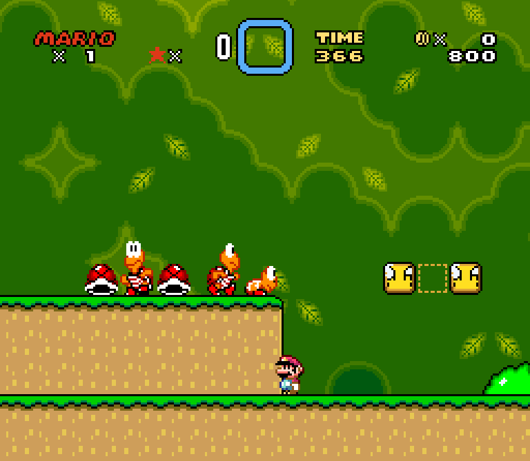
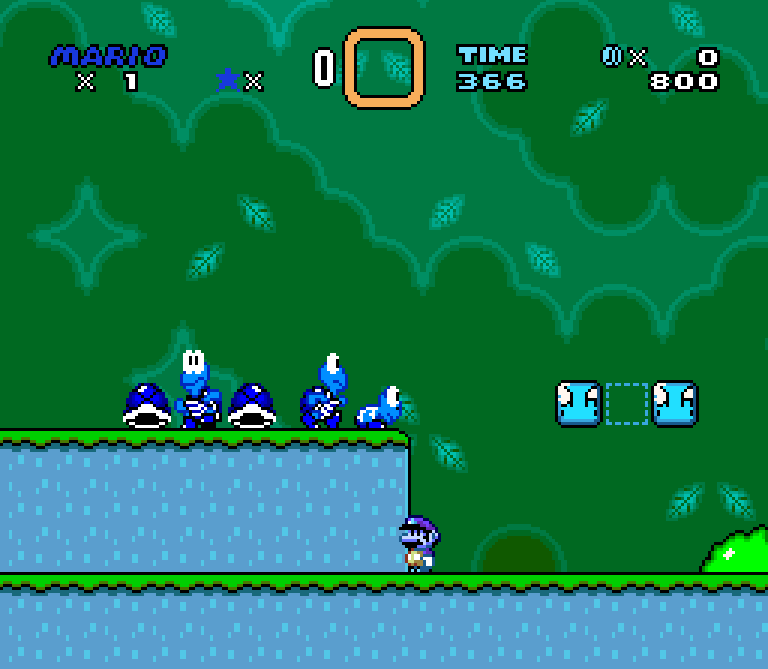

# Teaching Mario to play Super Mario World

This is a very simple example using tensorflow to play super maior world.

## Materials

Emulator, game and libraries used in this project

### Emulator and Rom

-   [Snes9x (emulator)](http://www.snes9x.com): Snes9x is a portable, freeware Super Nintendo Entertainment System (SNES) emulator. It basically allows you to play most games designed for the SNES and Super Famicom Nintendo game systems on your PC or Workstation; which includes some real gems that were only ever released in Japan.

-   [Super Mario World (rom)](https://romsmode.com/roms/super-nintendo/super-mario-world-404711): Super Mario World is a 1990 side-scrolling platform game developed and published by Nintendo for the Super Nintendo Entertainment System (SNES). The story follows Mario's quest to save Princess Toadstool and Dinosaur Land from the series antagonist Bowser and his minions, the Koopalings. The gameplay is similar to that of earlier Super Mario games: Players control Mario or his brother Luigi through a series of levels in which the goal is to reach the flagpole at the end. Super Mario World introduced Yoshi, a dinosaur who can eat enemies and gain abilities by eating the shells of Koopa Troopas.

<p align="center">
  
</p>

### Python libraries

As a prerequisite it is necessary to install [Python 3.8.0](https://www.python.org/downloads/) and the following libraries: . `pynput`, `opencv-python`, `pillow`, `pyscreenshot`, `numpy`, `pyautogui`

```dos
python -m pip install --upgrade pip
pip install pynput
pip install opencv-python
pip install Pillow==2.2.2
pip install pyscreenshot
pip install numpy
pip install PyAutoGUI
```

## Methods

1. Detect emulator window space
2. Agent's observation of the current environment 
  2.1 Capture screen and aplly filters
  2.2 Recognize score, life and time
3. An action provided to the environment
4. Amount of reward returned after previous action
5. Back to `Step 2`

### Window detection

Looking for the emulator window (dimension)

```python
# detect window name
# print(pyautogui.getAllTitles())
windows_name = 'Super Mario World - Snes9x 1.60'

# mapping {title : PID}
wins_named = dict(zip(pyautogui.getAllTitles(), pyautogui.getAllWindows()))

# get window size
x = wins_named[windows_name].left
y = wins_named[windows_name].top
w = wins_named[windows_name].width
h = wins_named[windows_name].height

# box: x1, y1, x2, y2
# add padding (8, 52, 8, 10)
dimension = (x+8, y+52, x+w-8, y+h-10)
```

Window with original values and window by padding

<p align="center">
  
  
</p>

Click on the window to select

```python
pyautogui.mouseDown(x + w / 2, y + h / 2)
time.sleep(0.2)
pyautogui.mouseUp()
```

### Screen capture

Example screenshot of game and applying filters

```python
size = get_screen_dimension()
image = ImageGrab.grab(size)
image = numpy.array(image)
image = cv2.resize(image, (0,0), fx = 0.25, fy = 0.25, interpolation=cv2.INTER_CUBIC)
image = cv2.Canny(image, threshold1 = 100, threshold2 = 200)
```

The figures below show: original screen capture, resize and Canny filter

<p align="center">
  
  
  
</p>

### Simulate the keyboard

Default play keys set in emulator

<p align="center">
  
</p>

Key mapping in code

```python
keys = [
    Key.up,                                 # UP
    Key.down,                               # DOWN
    Key.left,                               # LEFT
    Key.right,                              # RIGHT
    pynput.keyboard.KeyCode.from_char('x'),  # A
    pynput.keyboard.KeyCode.from_char('z'),  # B
    pynput.keyboard.KeyCode.from_char('s'),  # X
    pynput.keyboard.KeyCode.from_char('a'),  # Y
    pynput.keyboard.KeyCode.from_char('d'),  # L
    pynput.keyboard.KeyCode.from_char('c'),  # R
    Key.enter,                              # START
    Key.shift_r,                            # SELECT
]
```

Example of use key DOWN (index = 1)

```python
# Initialize keyboad
keyboard = Controller()

# Use keyboard
keyboard.press(keys[1])
time.sleep(0.2)
keyboard.release(keys[1])
```

### Detect Text of the HUD

Text ...

### Tensorflow model

Text ...

### Training

Text ...

## Experiments and Results

-   **Test 1**: Random keys (keyboard input) - https://youtu.be/-JA13GCZLVQ

## References

-   [How I built an AI to play Dino Run](https://medium.com/acing-ai/how-i-build-an-ai-to-play-dino-run-e37f37bdf153)
-   [How to Build a Python Bot That Can Play Web Games](https://code.tutsplus.com/tutorials/how-to-build-a-python-bot-that-can-play-web-games--active-11117)
-   [Playing Atari with Deep Reinforcement Learning](https://www.cs.toronto.edu/~vmnih/docs/dqn.pdf)
-   [Using Python to build an AI to play and win SNES StreetFighter II](https://www.youtube.com/watch?v=NyNUYYI-Pdg)


## Acknowledgment

-   Yuri Costa (alumnus) for recommending using the snes9x emulator

## Licença

    Copyright 2019 Kleber de Oliveira Andrade
    
    Permission is hereby granted, free of charge, to any person obtaining a copy
    of this software and associated documentation files (the "Software"), to deal
    in the Software without restriction, including without limitation the rights
    to use, copy, modify, merge, publish, distribute, sublicense, and/or sell
    copies of the Software, and to permit persons to whom the Software is
    furnished to do so, subject to the following conditions:
    
    The above copyright notice and this permission notice shall be included in all
    copies or substantial portions of the Software.
    
    THE SOFTWARE IS PROVIDED "AS IS", WITHOUT WARRANTY OF ANY KIND, EXPRESS OR
    IMPLIED, INCLUDING BUT NOT LIMITED TO THE WARRANTIES OF MERCHANTABILITY,
    FITNESS FOR A PARTICULAR PURPOSE AND NONINFRINGEMENT. IN NO EVENT SHALL THE
    AUTHORS OR COPYRIGHT HOLDERS BE LIABLE FOR ANY CLAIM, DAMAGES OR OTHER
    LIABILITY, WHETHER IN AN ACTION OF CONTRACT, TORT OR OTHERWISE, ARISING FROM,
    OUT OF OR IN CONNECTION WITH THE SOFTWARE OR THE USE OR OTHER DEALINGS IN THE
    SOFTWARE.
